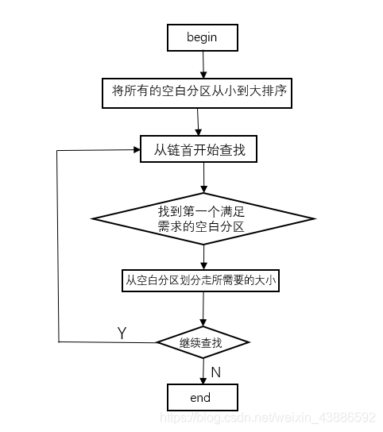

# 练习1：如何获取物理内存范围

访问物理内存`0x80000000`到`0x88000000`的DRAM配置信息

这段内存空间包含了所有外设信息,自然也包含物理内存大小

# 练习2：实现Best Fit页面分配算法

## Best Fit页面分配算法

将空闲分区链中的空闲分区按照空闲分区由小到大的顺序排序，从而形成空闲分区链。

每次从链首进行查找合适的空闲分区为作业分配内存，这样每次找到的空闲分区是和作业大小最接近的，所谓“最佳”。

## Best Fit页面分配算法具体实现

